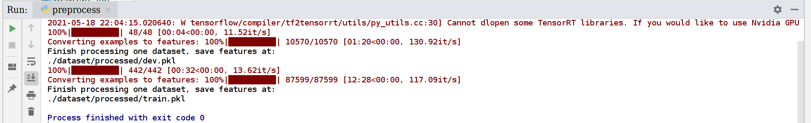

# Day0 预处理

调用了transformers包里的`squad_convert_examples_to_features`来处理SQuAD数据集，把它转换为SquadFeatures，其实最后返回的是features和dataset。为下一步直接Bert训练阅读理解做准备。

命令:

```
python preprocess.py
```

发现还是会跑接近15分钟的，dev集合的example数量达到了10570。




# Day1 训练

```
/home/tsq/anaconda3/bin/python /home/tsq/PycharmProjects/bosonnlp/SQuAD/train.py
```

想不通的问题:

- 损失函数怎么算的?
  - 相当于预测２个, start_token在每个位置要么是0(不存在)要么是1(存在), end_token是同理的
  - 最后的损失，就是2个预测logits和标准位置分布计算的交叉熵，然后取平均
- 滑动窗口是怎么实现的?
  - squad_convert_examples_to_features里面对doc_stride怎么使用?
- 为什么data_loader加载出来的数据量变多了?
  - 2021-05-19 14:31:25,414 SQuAD-QA INFO: length of train/valid per gpu: 117876/14621


# Day2 训练+验证

写好了训练部分得的代码，发现用我电脑的cpu，7.27s才能跑一篇，太慢了，改到服务器上去跑了

```
--train_batch_size 16 --device cuda
```

关于验证，我们需要使用features吗？还是直接从Bert词表转换回去?

如果验证的时候，predict_end_position比predict_start_position小怎么办? 抽取文章的哪个部分?(甚至标准答案里也有这种倒着大小的span)

- 抽取的肯定不是从input_id里面抽取的，因为第一个问题的答案就是[0:0]，抽取出来是[CLS]